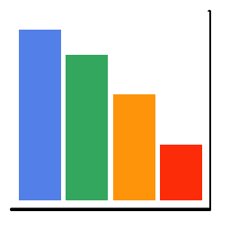

```{r setup, include=FALSE}
knitr::opts_chunk$set(echo = TRUE,
                      eval = TRUE,
                      fig.align = "left")
```

# Encabezados con RMarkdown

Un encabezado tipo 1, que es un título se denota con #  
Un encabezado tipo 2, que es un subtítulo se denota con ##  
Un encabezado tipo 3, que es un subtítulo de grado dos se denota con ###  

## Subtítulo

### Encabezado tipo 3

# Viñetas

  - Viñeta 1
      - Subviñeta 1
          - Subviñeta 1.1
  + Viñeta 2
      * Subviñeta 2
          + Subviñeta 2.1
  * Viñeta 3
      - Subviñeta 3.1
          + Subviñeta 3.1.1
          
# Insertando imagen



# Imagen centrada

<center>

</center>

# Hipervínculo 1

https://www.datacamp.com

# Hipervínculo 2

[DataCamp](https://www.datacamp.com)

# Opciones de texto

## Cursiva

_Texto_

## Negrilla

__Texto__

## Negrilla y cursiva

___Texto___

# Plot con R

```{r}
plot(iris)
```

# Otro plot con R

```{r, fig.align="center"}
plot(mtcars)
```


